# ⚡ AuraSlash: Autonomous AI Agent SLA Escrow & Behavioral Slashing Protocol

[](https://opensource.org/licenses/MIT)
[](https://docs.genlayer.com)
[](https://github.com/genlayerlabs)
[-00f5a0.svg)](#-test-suite--verification)

**AuraSlash** is a decentralized, intelligent SLA escrow and behavioral slashing protocol built natively on GenLayer. It solves the existential accountability crisis facing autonomous Web3 AI agents, keeper bots, and algorithmic delegates by conditioning service fee payouts and collateral slashing on **decentralized multi-validator neural consensus over live authority telemetry** (DexScreener DEX trades, GitHub task deliveries, BaseScan/Etherscan contract calls, and DefiLlama analytics).

---

## 🎯 The Web3 & AI Problem: Unaccountable Autonomous Agents

As DAOs and protocols increasingly hire off-chain AI agents to manage liquidity pools, execute rebalancing strategies, monitor smart contract security, and generate code, they face a fatal trust gap:
- **Zero Verifiable Accountability**: Traditional smart contracts cannot inspect whether an AI keeper bot adhered to risk bounds (e.g. max drawdown < 3%, latency < 30s) or hallucinated and drained liquidity.
- **Unbonded Execution**: If an autonomous agent fails or misbehaves, the hiring protocol absorbs 100% of the loss with zero restitution.
- **Oracle Limitations**: Traditional scalar price oracles (Chainlink) cannot parse unstructured, multi-source telemetry, API performance logs, or repository commit trees.

### 💡 Why GenLayer is Central to AuraSlash
GenLayer provides the only environment capable of trustlessly evaluating off-chain AI agent behavior:
1. **Live Authority Telemetry Grounding (`gl.nondet.web.get`)**: Validators independently retrieve real-time execution proof from whitelisted endpoints (DexScreener, GitHub API, BaseScan, DefiLlama).
2. **Multi-Validator Neural Consensus (`gl.vm.run_nondet_unsafe`)**: Validators analyze telemetry against contracted SLA bounds under the **Equivalence Principle** with strict canonical action decisions.
3. **Deterministic Slashing & Exact Payout Preservation**: Slashes the agent's collateral bond upon proven SLA breach or awards the escrow fee upon proven fulfillment with zero financial drift.

---

## 🏛️ Exact Payout Preservation & Canonical Action Consensus

To eliminate numeric drift and ambiguous threshold crossings, AuraSlash enforces **Canonical Action Decisions**:

| Canonical Action Decision | Validation Criteria | On-Chain Execution |
|---|---|---|
| **`RELEASE_ESCROW`** | `sla_verified == True` AND `confidence_score >= 80` | Releases escrow fee + collateral refund to Agent Operator (`emit_transfer(escrow + collateral)`) |
| **`SLASH_COLLATERAL`** | Verified SLA breach / hallucination / risk violation | Slashes agent collateral + refunds escrow fee to Client (`emit_transfer(escrow + collateral)`) |
| **`EXTEND_GRACE_PERIOD`** | Deliverable in progress (`confidence_score < 80`) | Agreement remains active for retry; zero funds released |

### Key Security & Solvency Invariants:
1. **🗓️ Fail-Closed Runtime Block Timing**: Timestamps are strictly derived from enforceable GenLayer runtime block state (`_get_runtime_timestamp()`). Unavailable timestamps strictly fail closed.
2. **🌐 Strict Authority Host Whitelist (SSRF Hardened)**: Exact hostname extraction neutralizes subdomain, query, and path spoofing (e.g., `dexscreener.com.attacker.com` is strictly rejected).
3. **🔒 Committed Source Adjudication Binding**: Adjudication is strictly bound to the target evidence URL committed on-chain during agreement creation. Callers cannot substitute uncommitted URLs.
4. **📡 Fail-Closed HTTP 200-299 Status Validation**: Telemetry responses missing explicit status or returning non-2xx status codes fail closed immediately.
5. **🏦 100% Solvency Invariant**: Tracks total active liabilities (`total_active_liabilities`) and prevents over-allocation.

---

## 🏛️ System Architecture

```mermaid
sequenceDiagram
    autonumber
    actor Client as 🏛️ Client / DAO
    participant AuraSlash as ⚡ AuraSlash (GenVM)
    actor Agent as 🤖 AI Agent Operator
    participant Validators as ⚖️ GenLayer Validators (Optimistic Democracy)
    participant Web as 🌐 Authority Telemetry (DexScreener / GitHub)

    Client->>AuraSlash: create_agreement(agent, "DEFI_KEEPER", sla_bounds, committed_url, collateral) + deposit 50 GEN
    Note over AuraSlash: Locks 50 GEN escrow & commits telemetry source with strict host validation
    Agent->>AuraSlash: stake_and_activate_agreement(agr_id) + deposit 20 GEN collateral
    Note over AuraSlash: Agreement status = ACTIVE (Total 70 GEN locked)
    
    Agent->>AuraSlash: adjudicate_agent_sla(agr_id, notes, committed_url)
    
    rect rgb(15, 23, 42)
        Note over AuraSlash,Validators: Non-Deterministic Multi-Validator Consensus
        Validators->>Web: gl.nondet.web.get(committed_url)
        Validators->>Validators: gl.nondet.exec_prompt(Evaluate SLA bounds & risk telemetry)
        Validators->>Validators: Equivalence Principle Check (Canonical Action Match & Non-Crossing Threshold)
    end

    alt SLA Verified (Confidence >= 80)
        AuraSlash->>Agent: emit_transfer(70 GEN) [Escrow Fee + Collateral Refund]
    else Severe Risk Breach / Exploit
        AuraSlash->>Client: emit_transfer(70 GEN) [Escrow Refund + Slashed Collateral Restitution]
    else Incomplete Telemetry
        AuraSlash->>AuraSlash: status = ACTIVE (Grace period extended for retry)
    end
```



---

## 📁 Repository Structure

```
auraslash-protocol/
├── contracts/
│   └── auraslash.py           # Core Intelligent Contract on GenVM
├── frontend/
│   ├── index.html             # Glassmorphic DApp UI with live genlayer-js client
│   └── client.ts              # TypeScript GenLayer client integration SDK
├── tests/
│   ├── direct/
│   │   └── test_auraslash.py  # 100% Passing in-memory direct VM test suite (7 scenarios)
│   └── integration/
│       └── test_auraslash_integration.py # StudioNet / RPC deployment integration tests
├── pytest.ini                 # Pytest direct suite collection configuration
├── gltest.config.yaml         # GenLayer Testnet/StudioNet network configuration
├── package.json               # genlayer-js & development dependencies
├── requirements.txt           # Python dependencies (genlayer, pytest)
└── README.md                  # Complete architectural & technical documentation
```

---

## 💻 Frontend & GenLayer Client Integration

The included interactive DApp (`frontend/index.html`) is connected to the real **`genlayer-js@1.2.0`** client, enabling full on-chain lifecycle management:

1. **Wallet / Account Management**: Auto-generates testnet keypairs or imports custom private keys.
2. **Multi-Network Support**: Switch seamlessly between **GenLayer Bradbury Testnet (4221)**, **StudioNet (4222)**, and **LocalNet**.
3. **SLA Escrow Deployment**: Create agreements, define granular SLA limits, and commit to authority endpoints (`create_agreement`).
4. **Agent Staking**: Deposit collateral bonds to activate agreements (`stake_and_activate_agreement`).
5. **Live Neural Adjudication**: Trigger multi-validator consensus over live authority telemetry (`adjudicate_agent_sla`).
6. **Live Contract State Queries**: Dynamically reads `get_agreement` and `get_protocol_stats` with explorer links.

### TypeScript Client Example (`frontend/client.ts`):

```typescript
import { getGenLayerClient, createAgreement, stakeAndActivateAgreement, adjudicateAgentSla, getAgreement } from './frontend/client';

const client = getGenLayerClient('0xYourPrivateKey...');
const contractAddress = '0xA7f9c2448B66B1b1d7d0823FBEB5A967732d888';

// 1. Client creates 7-day DeFi Keeper Agreement (50 GEN escrow, 20 GEN required collateral)
const tx1 = await createAgreement(
  client,
  contractAddress,
  '0xAgentOperator...',
  'DEFI_KEEPER_BOT',
  'Max drawdown < 3%, latency < 30s',
  'https://api.dexscreener.com/latest/dex/pairs/base/0x333...',
  20, // Required collateral
  86400 * 7,
  50 // Escrow deposit
);

// 2. Agent Operator stakes 20 GEN collateral to activate agreement
const tx2 = await stakeAndActivateAgreement(client, contractAddress, 0, 20);

// 3. Trigger SLA Adjudication on committed telemetry
const tx3 = await adjudicateAgentSla(client, contractAddress, 0, 'Completed 7-day rebalancing cycle', 'https://api.dexscreener.com/latest/dex/pairs/base/0x333...');

// 4. Query Final On-Chain State
const agr = await getAgreement(client, contractAddress, 0);
console.log(`Status: ${agr.status}, Verdict: ${agr.adjudication_verdict}, Confidence: ${agr.adjudication_confidence}%`);
```

---

## 🧪 Test Suite & Verification

Run the complete direct test suite:

```bash
pytest
# or
pytest tests/direct/ -v
```

### Verified Test Scenarios (7 Tests):
1. `test_sla_fulfillment_and_escrow_release`:
   - Client creates agreement with 50 GEN escrow. Agent deposits 20 GEN collateral.
   - Live telemetry proves 1.2% max drawdown (<3% limit).
   - Consensus on `RELEASE_ESCROW` (conf: 95) -> 70 GEN released to Agent.
2. `test_sla_breach_slashing_and_client_restitution` (Adversarial):
   - Agent breaches risk limits (8.4% drawdown).
   - Consensus on `SLASH_COLLATERAL` (conf: 98) -> 70 GEN awarded to Client.
3. `test_incomplete_sla_grace_period_extension`:
   - Sub-threshold progress triggers `EXTEND_GRACE_PERIOD` without releasing funds.
4. `test_mismatched_evidence_url_reverts` (Adversarial):
   - Reverts when caller attempts to submit an uncommitted URL during adjudication.
5. `test_untrusted_domain_spoofing_reverts` (Adversarial):
   - Rejects hostname substring spoofing attempts (e.g. `dexscreener.com.attacker.com`).
6. `test_unauthorized_early_release_reverts` (Fail-Closed):
   - Verifies active agreements cannot be released before expiration.
7. `test_non_operator_stake_reverts` (Access Control):
   - Enforces that only the designated operator can deposit collateral.

---

## 📄 License

MIT © [Lesnak1](https://github.com/Lesnak1) & GenLayer Community
