# ⚡ AuraSlash: Autonomous AI Agent SLA Escrow & Behavioral Slashing Protocol

[](https://opensource.org/licenses/MIT)
[](https://docs.genlayer.com)
[](https://github.com/genlayerlabs)
[-00f5a0.svg)](#-test-suite--verification)

**AuraSlash** is a decentralized, intelligent SLA escrow and behavioral slashing protocol built natively on GenLayer. It solves the existential accountability crisis facing autonomous Web3 AI agents, keeper bots, and algorithmic delegates by conditioning service fee payouts and collateral slashing on **decentralized multi-validator neural consensus over live authority telemetry** (DexScreener DEX trades, GitHub task deliveries, BaseScan/Etherscan contract calls, and DefiLlama analytics).

---

## 🎯 The Web3 & AI Problem: Unaccountable Autonomous Agents

As DAOs and protocols increasingly hire off-chain AI agents to manage liquidity pools, execute rebalancing strategies, monitor smart contract security, and generate code, they face a fatal trust gap:
- **Zero Verifiable Accountability**: Traditional smart contracts cannot inspect whether an AI keeper bot adhered to risk bounds (e.g. max drawdown < 3%, latency < 30s) or hallucinated and drained liquidity.
- **Unbonded Execution**: If an autonomous agent fails or misbehaves, the hiring protocol absorbs 100% of the loss with zero restitution.
- **Oracle Limitations**: Traditional scalar price oracles (Chainlink) cannot parse unstructured, multi-source telemetry, API performance logs, or repository commit trees.

### 💡 Why GenLayer is Central to AuraSlash
GenLayer provides the only environment capable of trustlessly evaluating off-chain AI agent behavior:
1. **Live Authority Telemetry Grounding (`gl.nondet.web.get`)**: Validators independently retrieve real-time execution proof from whitelisted endpoints (DexScreener, GitHub API, BaseScan, DefiLlama).
2. **Multi-Validator Neural Consensus (`gl.vm.run_nondet_unsafe`)**: Validators analyze telemetry against contracted SLA bounds under the **Equivalence Principle** with strict canonical action decisions.
3. **Observation Window Completion Invariant**: Irreversible escrow fee payout (`RELEASE_ESCROW`) cannot occur before the agreed observation window has fully elapsed (`current_ts >= end_timestamp`).
4. **Constrained Early Slashing**: Catastrophic risk breaches / circuit breaker triggers allow immediate emergency slashing (`SLASH_COLLATERAL`, conf >= 80) even mid-window to protect client funds.
5. **404 & Network Failure Retry Protection**: HTTP 404s, missing endpoints, or server errors are strictly treated as retry outcomes (`EXTEND_GRACE_PERIOD`), NEVER as grounds for slashing.

---

## 🏛️ Exact Payout Preservation & Canonical Action Consensus

To eliminate numeric drift and ambiguous threshold crossings, AuraSlash enforces **Canonical Action Decisions**:

| Canonical Action Decision | Validation Criteria | On-Chain Execution |
|---|---|---|
| **`RELEASE_ESCROW`** | `sla_verified == True` AND `confidence_score >= 80` AND `current_ts >= end_timestamp` | Releases escrow fee + collateral refund to Agent Operator (`emit_transfer(escrow + collateral)`) |
| **`SLASH_COLLATERAL`** | Verified affirmative SLA breach / catastrophic risk violation AND `confidence_score >= 80` | Slashes agent collateral + refunds escrow fee to Client (`emit_transfer(escrow + collateral)`) |
| **`EXTEND_GRACE_PERIOD`** | Mid-term healthy status, 404s, network errors, or sub-threshold confidence (`confidence < 80`) | Agreement remains active for retry / full term; zero funds released |

### Key Security & Solvency Invariants:
1. **🗓️ Fail-Closed Runtime Block Timing**: Timestamps are strictly derived from enforceable GenLayer runtime block state (`_get_runtime_timestamp()`). Unavailable timestamps strictly fail closed.
2. **🌐 Strict Authority Host Whitelist (SSRF Hardened)**: Exact hostname extraction neutralizes subdomain, query, and path spoofing (e.g., `dexscreener.com.attacker.com` is strictly rejected).
3. **🔒 Committed Source Adjudication Binding**: Adjudication is strictly bound to the target evidence URL committed on-chain during agreement creation. Callers cannot substitute uncommitted URLs.
4. **📡 Fail-Closed HTTP 200-299 Status Validation**: Telemetry responses missing explicit status or returning non-2xx status codes fail closed immediately.
5. **🏦 100% Solvency Invariant**: Tracks total active liabilities (`total_active_liabilities`) and prevents over-allocation.

---

## 👥 Verified Two-Account Signing & Funding Workflow

AuraSlash natively separates the **Client (Creator / Funder)** and **Agent Operator (Staker / Bot)** signing paths:

```typescript
import { getGenLayerClient, createAgreement, stakeAndActivateAgreement, adjudicateAgentSla, DEMO_CLIENT_CONFIG, DEMO_OPERATOR_CONFIG } from './frontend/client';

// Client Account (Alice: 0x7099...79C8)
const clientSigner = getGenLayerClient(DEMO_CLIENT_CONFIG.privateKey);

// Operator Account (Bob: 0x3C44...93BC)
const operatorSigner = getGenLayerClient(DEMO_OPERATOR_CONFIG.privateKey);

const contractAddress = '0x71c563d420188047915512702759902641203001';

// 1. Client locks 50 GEN escrow fee and creates Agreement
const tx1 = await createAgreement(
  clientSigner,
  contractAddress,
  DEMO_OPERATOR_CONFIG.address, // Designates Bob as Operator
  'DEFI_KEEPER_BOT',
  'Maintain max drawdown < 3%, latency < 30s',
  'https://api.dexscreener.com/latest/dex/pairs/base/0x3333333333333333333333333333333333333333',
  20, // Required collateral
  86400 * 7, // 7-day observation window
  50 // Escrow fee deposit
);

// 2. Operator deposits 20 GEN collateral bond to activate agreement
const tx2 = await stakeAndActivateAgreement(operatorSigner, contractAddress, 0, 20);

// 3. Trigger SLA Adjudication on committed telemetry
const tx3 = await adjudicateAgentSla(clientSigner, contractAddress, 0, 'Full 7-day rebalancing cycle complete', 'https://api.dexscreener.com/latest/dex/pairs/base/0x3333333333333333333333333333333333333333');
```

---

## 🏛️ System Architecture

```mermaid
sequenceDiagram
    autonumber
    actor Client as 🏛️ Client / DAO
    participant AuraSlash as ⚡ AuraSlash (GenVM)
    actor Agent as 🤖 AI Agent Operator
    participant Validators as ⚖️ GenLayer Validators (Optimistic Democracy)
    participant Web as 🌐 Authority Telemetry (DexScreener / GitHub)

    Client->>AuraSlash: create_agreement(agent, "DEFI_KEEPER", sla_bounds, committed_url, collateral) + deposit 50 GEN
    Note over AuraSlash: Locks 50 GEN escrow & commits telemetry source with strict host validation
    Agent->>AuraSlash: stake_and_activate_agreement(agr_id) + deposit 20 GEN collateral
    Note over AuraSlash: Agreement status = ACTIVE (Total 70 GEN locked)
    
    Agent->>AuraSlash: adjudicate_agent_sla(agr_id, notes, committed_url)
    
    rect rgb(15, 23, 42)
        Note over AuraSlash,Validators: Non-Deterministic Multi-Validator Consensus
        Validators->>Web: gl.nondet.web.get(committed_url)
        Validators->>Validators: gl.nondet.exec_prompt(Evaluate SLA bounds & risk telemetry)
        Validators->>Validators: Equivalence Principle Check (Canonical Action Match & Non-Crossing Threshold)
    end

    alt SLA Verified & Full Observation Window Elapsed (Confidence >= 80)
        AuraSlash->>Agent: emit_transfer(70 GEN) [Escrow Fee + Collateral Refund]
    else Severe Risk Breach / Exploit (Emergency Early Slashing)
        AuraSlash->>Client: emit_transfer(70 GEN) [Escrow Refund + Slashed Collateral Restitution]
    else Mid-Term Healthy or Incomplete Telemetry
        AuraSlash->>AuraSlash: status = ACTIVE (Grace period extended for full term)
    end
```



---

## 📁 Repository Structure

```
auraslash-protocol/
├── contracts/
│   └── auraslash.py           # Core Intelligent Contract on GenVM
├── frontend/
│   ├── index.html             # Glassmorphic DApp UI with two-account persona switcher
│   ├── client.ts              # TypeScript GenLayer client integration SDK
│   └── genlayer-js.d.ts       # Local TypeScript type declarations
├── tests/
│   ├── direct/
│   │   ├── test_auraslash.py       # 10 comprehensive unit tests (Fail-closed, 404 retry, confidence floor)
│   │   └── test_two_account_flow.py # End-to-end multi-account signing & lifecycle test
│   └── integration/
│       └── test_auraslash_integration.py # StudioNet / RPC deployment integration tests
├── tsconfig.json              # TypeScript configuration
├── pytest.ini                 # Pytest direct suite collection configuration
├── gltest.config.yaml         # GenLayer Testnet/StudioNet network configuration
├── package.json               # genlayer-js & development dependencies
├── requirements.txt           # Python dependencies (genlayer, pytest)
└── README.md                  # Complete architectural & technical documentation
```

---

## 🧪 Test Suite & Verification

Run the complete direct test suite:

```bash
pytest
# or
pytest tests/direct/ -v
```

### Verified Test Scenarios (11/11 Tests Passing):
1. `test_sla_fulfillment_and_escrow_release`: Full lifecycle across full observation window -> 70 GEN released to Agent.
2. `test_premature_release_before_observation_window_complete_is_held_as_active`: Mid-window evaluation is held as `ACTIVE` with 0 funds moved.
3. `test_emergency_early_slashing_on_catastrophic_breach`: Legitimate early settlement constrained to catastrophic breach -> emergency slash protects client capital.
4. `test_repeated_404_responses_leave_agreement_active_and_move_no_funds`: 404 responses are strictly retry outcomes with 0 funds moved.
5. `test_sub_threshold_confidence_cannot_slash_and_moves_no_funds`: Sub-threshold confidence (<80%) cannot slash collateral.
6. `test_sla_breach_slashing_and_client_restitution_with_high_confidence`: High confidence breach slashes collateral to client.
7. `test_incomplete_sla_grace_period_extension`: Sub-threshold progress triggers `EXTEND_GRACE_PERIOD`.
8. `test_mismatched_evidence_url_reverts`: Reverts when caller attempts to submit an uncommitted URL.
9. `test_untrusted_domain_spoofing_reverts`: Rejects hostname substring spoofing attempts.
10. `test_unauthorized_early_release_reverts`: Verifies active agreements cannot be released before expiration.
11. `test_two_account_signing_and_lifecycle_flow`: Verifies end-to-end multi-account execution between Alice and Bob.

---

## 📄 License

MIT © [Lesnak1](https://github.com/Lesnak1) & GenLayer Community
